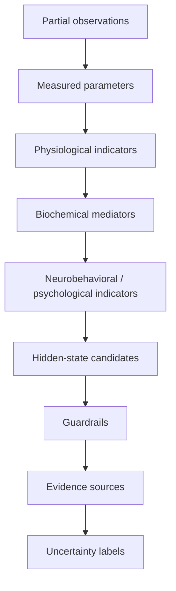
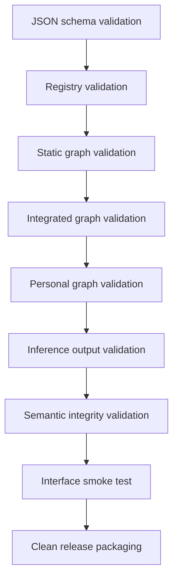

# BodyState Mapper

> Mermaid compatibility note: the diagrams below use Mermaid syntax. They render on
> GitHub and in any Markdown viewer with Mermaid support. If your viewer does not render
> Mermaid, the diagram source is still readable as plain text inside each fenced block.

## Reviewer quick path

1. Read the project summary and the "what this project does not claim" section below.
2. Inspect the system architecture diagram to understand curated vs generated artifacts.
3. Run the validation suite: `python3 scripts/run_all_validations.py`.
4. Open the integrated graph output:
   `outputs/astronaut_data_mapping_v1_0/integrated_evidence_graph_v1_0.json`.
5. Inspect the interactive interface (see "Interactive interface" below).
6. Build a clean release: `python3 scripts/package_release.py`.

## Project summary

- Scientific name: Traceable Human State Inference Under Partial Biological Observability.
- Public name: BodyState Mapper.

BodyState Mapper is a traceable evidence-graph system that maps partial biological
observations (for example heart-rate variability, sleep, cortisol, and other measured
parameters) to hidden physiological and psychological state hypotheses, while preserving
uncertainty and explicit links back to the scientific sources that justify each
relationship. Every inferred state is accompanied by the measurements that support it,
the guardrails that constrain its interpretation, the missing data that would reduce
uncertainty, and the next-best measurements to collect. It is a reasoning and
traceability tool, not a clinical instrument.

## What this project does not claim

- It does not diagnose any medical or psychological condition.
- It does not infer certainty from incomplete data; partial input yields hypotheses,
  not conclusions.
- It preserves and reports uncertainty rather than collapsing it into a single score.
- It treats missing data explicitly as missing, never as negative evidence.
- It requires source traceability: every relationship traces to a registered evidence
  source.

## Repository structure

- `data/` — curated scientific core: evidence source registry, static nodes and edges,
  reviewed source metadata, the source-claim registry, and demo inputs.
- `schemas/` — JSON Schemas governing the curated data and generated artifacts.
- `scripts/` — build, synchronization, and validation scripts (curated tooling).
- `sources_pdf/` — local source artifacts (the PDFs behind the evidence registry). These
  are checked by validators (each registry entry must reference a present PDF).
- `outputs/` — generated/integrated artifacts: the integrated evidence graph, the
  astronaut data-mapping package, generated measurement mappings, inference chains,
  validation reports, and interface inputs.
- `interface/` — static, offline reviewer dashboard (HTML/CSS/JS).
- `docs/` — project documentation, including the data governance policy.

Curated artifacts (under `data/`, `schemas/`, `scripts/`) are authored and reviewed.
Generated artifacts (under `outputs/`) are produced by the build scripts and are
reproducible from the curated core.

## System architecture


## Evidence inference logic

The pipeline moves from partial observations to labelled hidden-state hypotheses in
explicit, traceable steps. It never jumps from raw data directly to a psychological
interpretation: each step passes through measured parameters, physiological indicators,
and biochemical mediators before any neurobehavioral or psychological hypothesis is
proposed, and every hypothesis carries guardrails, source links, and uncertainty labels.



## Validation pipeline



## Current project statistics

<!-- AUTO-GENERATED-STATS:START -->
_Last updated: 2026-06-12T20:32:52.461826+00:00 (generated by `scripts/update_readme_stats.py`)._

| Metric | Value |
|---|---|
| Total nodes | 1979 |
| Total edges | 5698 |
| Measured parameters | 498 |
| Required measurements | 465 |
| Hidden-state nodes | 54 |
| Guardrails | 194 |
| PDF sources | 15 |
| JSON files | 139 |
| Validation status | PASS |
<!-- AUTO-GENERATED-STATS:END -->

## How to run validations

Run the full suite (works from the project root or from inside `scripts/`):

```bash
python3 scripts/run_all_validations.py
```

Individual validators can be run directly, for example:

```bash
python3 scripts/validate_registry.py
python3 scripts/validate_semantic_integrity_v1_0.py
```

## How to rebuild outputs

The generated artifacts are reproducible from the curated core:

```bash
python3 scripts/build_v1_0_knowledge_package.py
python3 scripts/sync_inference_chains_v1_0.py
python3 scripts/build_source_claim_registry_v1_0.py
```

`sync_inference_chains_v1_0.py` reconstructs `inference_chains_v1_0.json` from the
authoritative integrated graph; run it with `--check` to verify the export is in sync.

## Interactive interface

The interface is a static, offline dashboard. Serve the project root over HTTP and open
the interface in a browser:

```bash
cd "<project root>" && python3 -m http.server 8000
```

Then open: http://localhost:8000/interface/

The dashboard loads the integrated evidence graph and renders evidence maps, hidden-state
candidates, parameters, guardrails, corpus coverage, and source traceability. It makes no
network requests and displays the mandatory "This is not a diagnosis." safety line.

## Data governance

The project separates a curated scientific core from generated outputs. Generated
artifacts are promoted to the curated core only after source traceability, schema
validation, semantic validation, explicit uncertainty/causal status, and recorded
limitations are all satisfied. No evidence is invented. See
[`docs/data_governance_v1_0.md`](docs/data_governance_v1_0.md) for the full policy.

## Release packaging

Build a clean release archive (excludes VCS internals, OS/cache artifacts, environments,
and `dist/` itself):

```bash
python3 scripts/package_release.py
```

This writes `dist/BodyState_Mapper_clean_release_v1_0.zip` and prints the included files,
excluded files, final path, and archive size.

## Limitations and remaining risks

- The system is not a diagnostic tool and must not be used to make clinical decisions.
- Outputs are hypotheses conditioned on partial observations; their confidence depends on
  the completeness and quality of the input data.
- Some measured parameters carry measurement-source provenance but no explicit
  measurement-modality metadata; these are accepted on provenance and flagged for review.
- A subset of hidden-state nodes are scaffolds marked for review and are not yet backed by
  incoming evidence edges; they are excluded from supported-state guarantees.
- The evidence corpus is a curated, finite set of sources and does not represent the full
  scientific literature.
